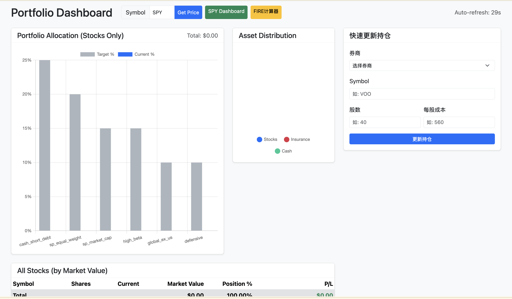
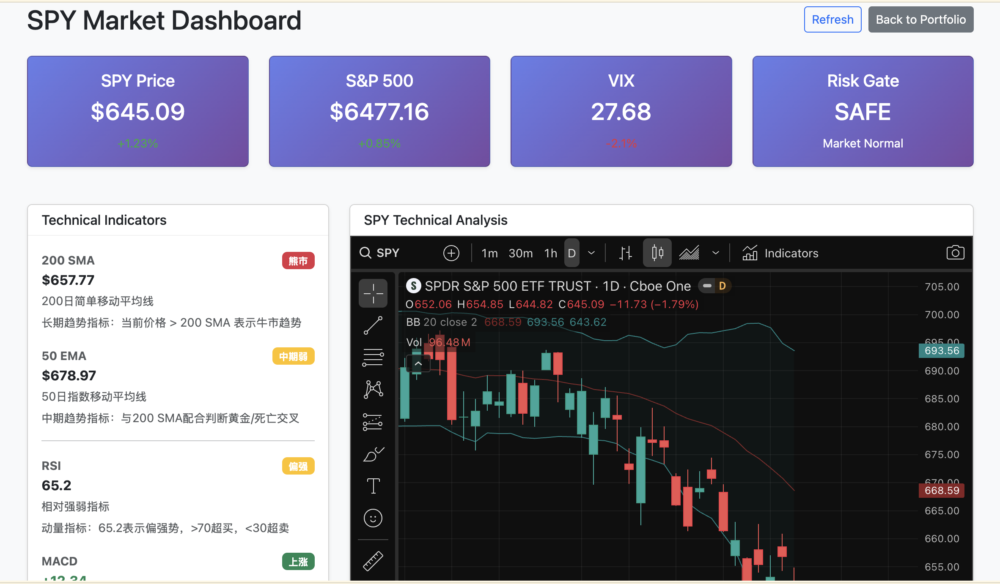
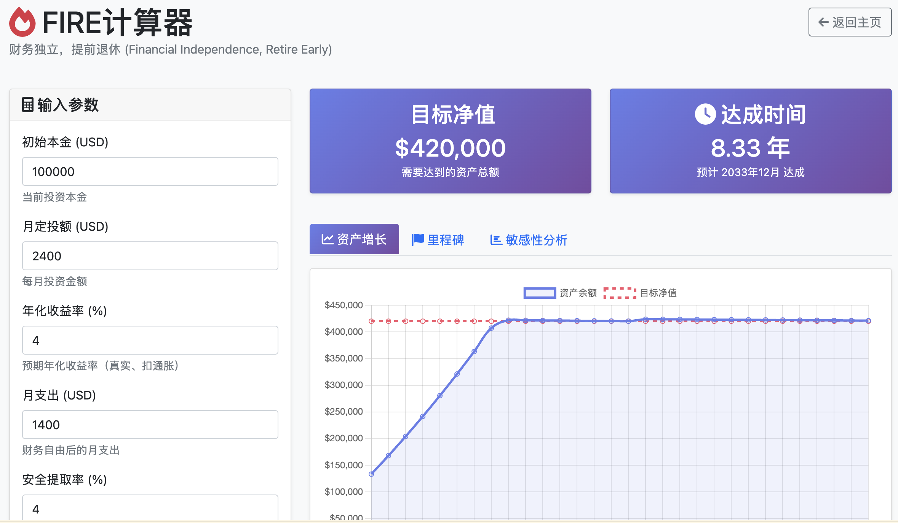

# Personal Asset Management Platform

**[English]** · [中文](README_CN.md)

A self-hosted investment dashboard for US stock investors — built because no existing tool does exactly what I need, and because AI makes it practical to build one that does.

---

## Why I Built This

My assets are scattered. US brokerage accounts, a Chinese bank account, an insurance policy, WeChat Pay balance, and a handful of ETF positions spread across two brokers. None of the popular portfolio trackers handle this mix well — they either don't support Chinese assets, require you to hand over broker credentials, or lock you into a subscription to see your own data.

The deeper problem is the investment strategy itself. I follow a rules-based allocation framework: fixed target weights across six asset categories, a risk gate that triggers when the market is genuinely stressed (S&P 500 below 200-day SMA *and* VIX above 30), and stage-based behavior that shifts as I move from accumulation toward early retirement. This is specific enough that no off-the-shelf dashboard will track it correctly.

So I built my own.

---

## The AI Angle

There are two places where AI meaningfully changes what's possible here.

**Building the system.** This entire codebase was built with AI assistance. The strategy logic, the OCR pipeline, the rebalancing math — these would have taken weeks to get right solo. With an LLM as a pair programmer, a working prototype happened in days. The code quality is better too: edge cases get caught, the API design is cleaner, the error handling is more thorough than I'd write under time pressure.

**Getting the data in.** This is the harder problem, and it's where AI earns its keep most clearly.

Most financial data is locked behind apps. Your broker doesn't expose a developer API. Your bank's "export" button generates a PDF that nothing can parse. Your insurance company's portal is a mobile app with no web version. The data exists — you can *see* it — but it's not in any form a program can consume.

The solution: **screenshot → LLM → structured data → manual review → import**.

1. Take a screenshot of the broker/bank app (phone screenshot, web screenshot, whatever)
2. Pass it to a vision-capable LLM with a prompt that extracts holdings data as JSON
3. Review the output — catch any misread numbers, fix ticker symbols
4. Import via the API

This workflow has a key property: **manual participation is a feature, not a bug**. You read every number before it goes into the system. You catch the OCR mistake where 28 shares became 28.0 or where the cost basis got pulled from the wrong column. The human review step is a fast sanity check, not a burden, and it means the data you're analyzing is data you've actually seen.

The result is that this platform can ingest from *any* financial institution — not just the ones with official APIs — as long as you can take a screenshot of the account page.

---

## What It Does

- **Portfolio dashboard** — real-time holdings with P&L, current vs. target allocation chart, total value across all accounts and currencies (USD/CNY unified)
- **Risk gate monitor** — tracks S&P 500 vs. 200-day SMA and VIX in real time; shows whether the risk gate is open or closed
- **Rebalancing suggestions** — calculates deviation from target weights; tells you what to buy and sell to rebalance
- **SPY dashboard** — S&P 500 price + technical indicator view
- **FIRE calculator** — projects months to financial independence given current savings rate and target

## Screenshots







---

## Data Flow

```
Financial accounts (broker apps, bank apps, screenshots)
        │
        ▼
Screenshot + LLM extraction (OCR service)
        │
        ▼
Manual review + corrections
        │
        ▼
Import API
        │
        ▼
SQLite (app.db) — holdings, price history, risk gate state
        │
Yahoo Finance (live prices) ──► In-memory cache
        │
        ▼
FastAPI — strategy engine, rebalancing math
        │
        ▼
Browser dashboard
```

---

## Investment Strategy

The platform is built around a specific allocation framework. You can modify these in `app/config.py`.

### Target Allocation

| Category | Symbols | Weight |
|---|---|---|
| Cash / Short-term debt | DUSB, SGOV | 25% |
| S&P Equal Weight | RSP, SPYV | 20% |
| S&P Market Cap | SPY, VOO | 15% |
| High Beta | NVDA, QQQ | 15% |
| Global ex-US | DFAW | 10% |
| Defensive | BRK.B, GLD | 10% |

### Risk Gate

Triggers when **both** conditions are met simultaneously:
- S&P 500 closes below its 200-day moving average
- VIX > 30

Clears after S&P 500 closes above 200-day SMA for 10 consecutive days. The idea: one condition alone is noise; both together signals genuine market stress worth acting on.

---

## Quick Start

**Prerequisites:** Python 3.11+ (no Docker required)

```bash
git clone <this-repo>
cd asset_mgt

python3 -m venv venv
source venv/bin/activate
pip install -r requirements.txt

cp .env.example .env
./start.sh
```

Open **http://localhost:8000**. A demo user is created automatically on first startup.

### Importing Your Holdings

**Option A — Manual via API (fastest for small portfolios)**
```bash
curl -X POST http://localhost:8000/api/v1/portfolio/1/holdings \
  -H "Content-Type: application/json" \
  -d '{"symbol":"VOO","shares":10,"cost_basis":450.00,"broker_name":"Your Broker"}'
```

**Option B — Screenshot pipeline (for locked-down brokers/banks)**
1. Take a screenshot of your account's holdings page
2. POST to `/api/v1/ocr/extract` with the image — the LLM returns structured JSON
3. Review the extracted data, correct any errors
4. POST the corrected data to `/api/v1/portfolio/1/holdings`

Requires an LLM API key in `.env` (`OPENAI_API_KEY` or `ANTHROPIC_API_KEY`).

---

## Pages

| URL | Description |
|---|---|
| `/` | Main portfolio dashboard |
| `/spy-dashboard` | SPY / S&P 500 technical monitor |
| `/fire-calc` | FIRE retirement calculator |
| `/docs` | Swagger API docs |
| `/health` | Health check |

---

## Architecture

```
FastAPI (port 8000)
├── /api/v1/auth        — demo user setup
├── /api/v1/portfolio   — holdings CRUD + price refresh
├── /api/v1/strategy    — allocation analysis, risk gate, rebalancing
├── /api/v1/market      — live prices, indicators, exchange rates
├── /api/v1/ocr         — screenshot → structured holdings extraction
└── /api/v1/fire        — FIRE projection calculations

app.db (SQLite)         — holdings, price history, risk gate state
In-memory cache         — price + indicator cache (60s TTL, cleared on restart)
```

Market prices come from Yahoo Finance (free, ~15-min delay during market hours). Optional Alpha Vantage / IEX Cloud for more frequent updates.

---

## Project Structure

```
asset_mgt/
├── app/                    # FastAPI application
│   ├── api/                # Route handlers (portfolio, strategy, market, ocr, fire)
│   ├── models/             # SQLAlchemy models
│   ├── services/           # Business logic (market data, strategy, OCR)
│   ├── schemas/            # Pydantic request/response models
│   ├── static/             # Frontend HTML pages
│   └── main.py
├── docs/
│   ├── screenshots/        # UI screenshots
│   └── system_design.md    # Architecture and design notes
├── scripts/                # Data import and maintenance scripts
│   ├── fix_fund_price.sh
│   ├── remove_interactive_holdings.sh
│   ├── update_holdings_fix.sh
│   └── input_data_demo.txt
├── tests/
│   └── test_system.py
├── tools/                  # Utility scripts (OCR helpers, web scrapers)
├── .env.example
├── docker-compose.yml      # Optional: PostgreSQL override
├── requirements.txt
└── start.sh
```

## Development

```bash
# Run system tests
venv/bin/python3 tests/test_system.py

# API docs
open http://localhost:8000/docs
```
