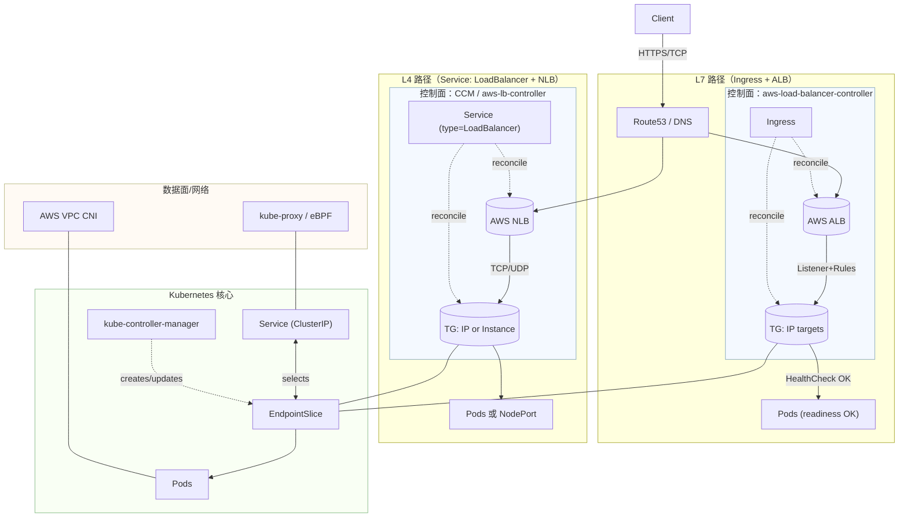

```mermaid
flowchart TD
  %% Clients & DNS
  U[Client] -->|HTTPS/TCP| R53[Route53 / DNS]

  %% L7 Path (ALB + Ingress)
  subgraph L7["L7 路径（Ingress + ALB）"]
    R53 --> ALB[(AWS ALB)]
    ALB -->|Listener+Rules| TGi[(TG: IP targets)]
    TGi -->|HealthCheck OK| PODS_ALB["Pods (readiness OK)"]
    subgraph IngressPlane["控制面：aws-load-balancer-controller"]
      ING[Ingress]
      ING -.reconcile.-> ALB
      ING -.reconcile.-> TGi
    end
  end

  %% L4 Path (NLB + Service LB)
  subgraph L4["L4 路径（Service: LoadBalancer + NLB）"]
    R53 --> NLB[(AWS NLB)]
    NLB -->|TCP/UDP| TGn[(TG: IP or Instance)]
    TGn --> PODS_NLB["Pods 或 NodePort"]
    subgraph SVCPlane["控制面：CCM / aws-lb-controller"]
      SVC_LB["Service (type=LoadBalancer)"]
      SVC_LB -.reconcile.-> NLB
      SVC_LB -.reconcile.-> TGn
    end
  end

  %% K8s Core
  subgraph K8s["Kubernetes 核心"]
    SVC_CIP["Service (ClusterIP)"]
    EPS[EndpointSlice]
    SVC_CIP <--selects--> EPS
    EPS --> PODS[Pods]
    KCM[kube-controller-manager] -.creates/updates.-> EPS
  end

  %% Data plane helpers
  subgraph Dataplane["数据面/网络"]
    CNI[AWS VPC CNI]
    KP[kube-proxy / eBPF]
  end
  CNI --- PODS
  KP --- SVC_CIP

  %% Relations
  TGi --- EPS
  TGn --- EPS

  style IngressPlane fill:#f4f9ff,stroke:#8ab
  style SVCPlane fill:#f4f9ff,stroke:#8ab
  style K8s fill:#f9fff4,stroke:#8b8
  style Dataplane fill:#fffaf4,stroke:#bb8

```